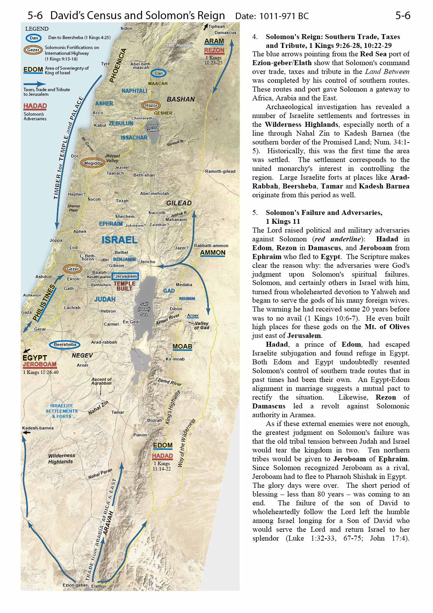
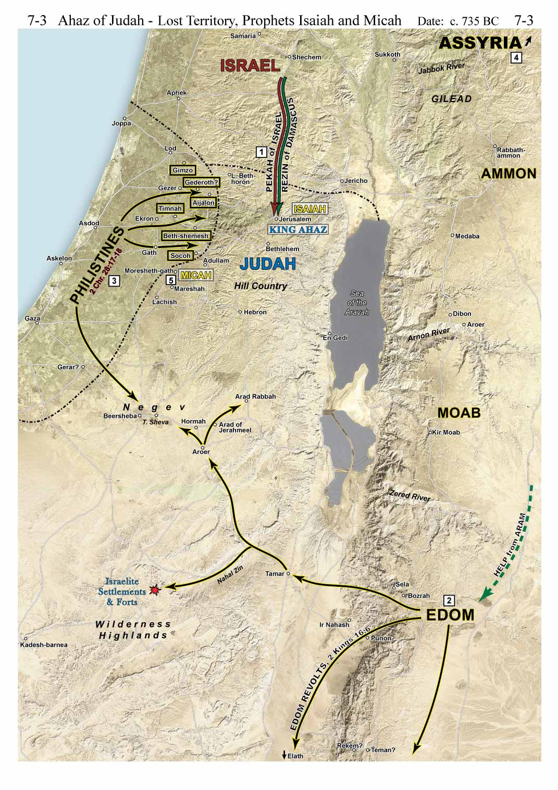
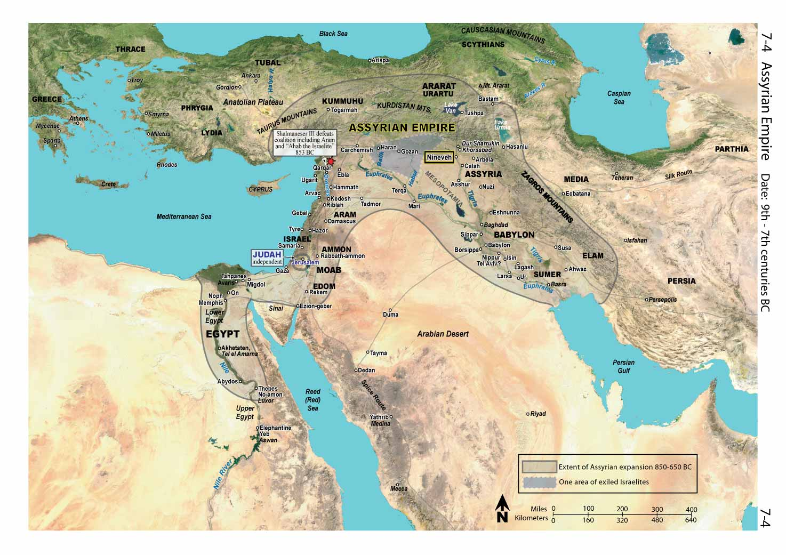
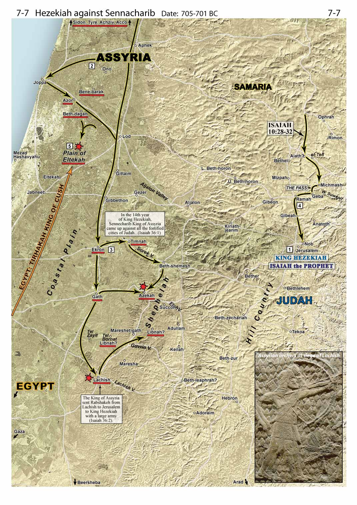
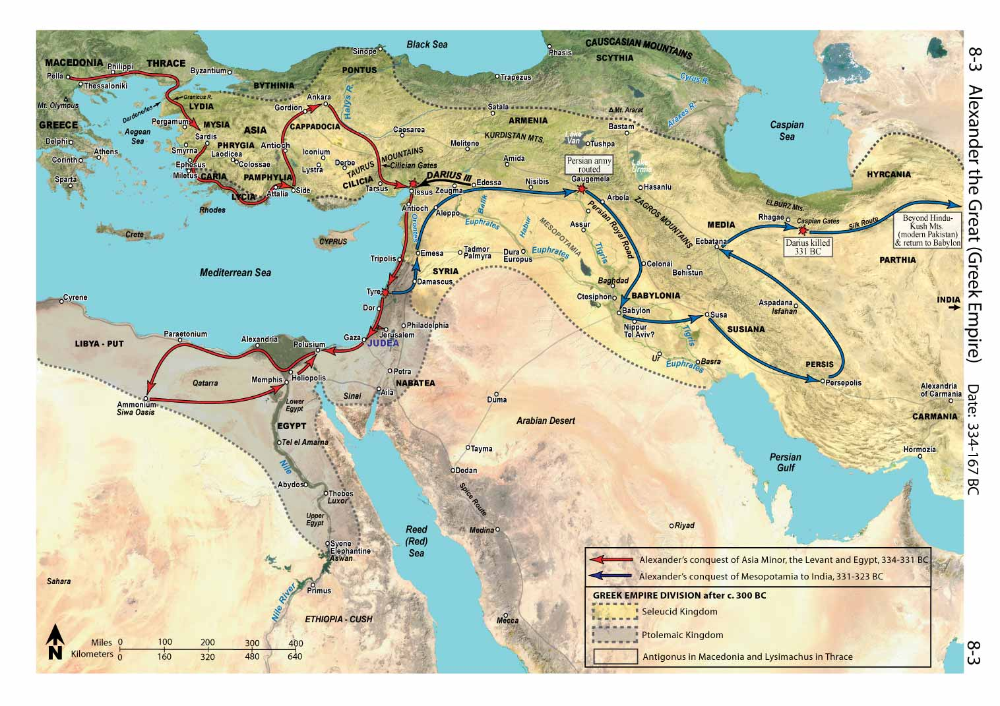
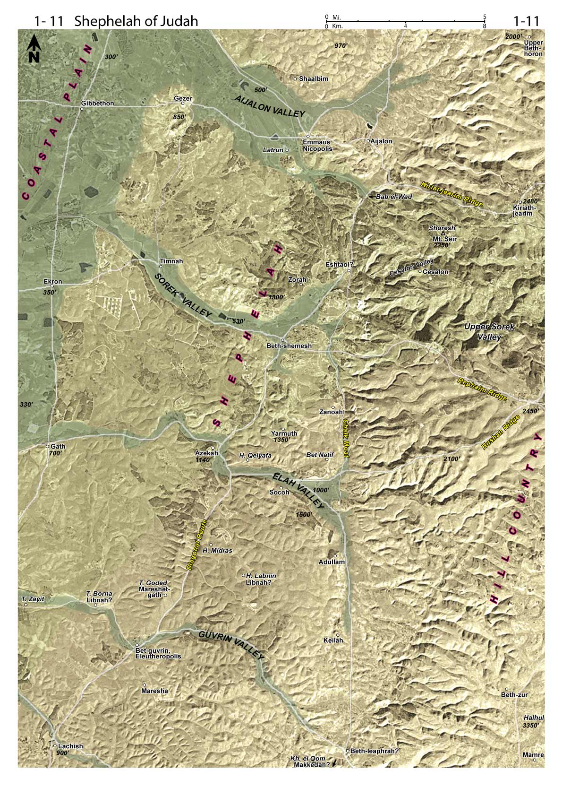

= Map Index

== List of Maps

=== Israelite Conquest and Early Periods
* <<map-israelite-conquest,Israelite Conquest - Central and Southern>>
* <<map-joshua-northern-campaign,Joshua's Northern Campaign>>
* <<map-amarna,Amarna>>

=== Tribal Allotments and Early Judges
* <<map-tribal-allotments,Tribal Allotments>>
* <<map-unconquered-territories,Unconquered Territories>>
* <<map-early-judges,Early Judges>>
* <<map-egypt-19th-dynasty,19th Dynasty of Egypt>>
* <<map-deborah-barak,Deborah and Barak>>
* <<map-gideon,Gideon>>
* <<map-jephthah,Jephthah>>
* <<map-samson,Samson>>
* <<map-judges-appendices-ruth,Judges Appendices and Ruth>>

=== Kingdom of Israel and Judah
* <<map-samuel,Samuel>>
* <<map-saul,Saul>>
* <<map-david-and-saul,David and Saul>>
* <<map-david-at-ziklag,David at Ziklag>>
* <<map-david-reign,David's Reign>>
* <<map-david-and-solomon,David and Solomon>>

=== Division and Exile
* <<map-division-of-kingdom,Division of the Kingdom>>
* <<map-judah-border-dispute,Judah Border Dispute and Asa>>
* <<map-elijah-omri-ahab-aram,Elijah, Omri, Ahab, and Aram>>
* <<map-mesha,Mesha>>
* <<map-elisha-jehoram-jehu-aram,Elisha, Jehoram, Jehu, and Aram>>

=== Assyrian and Babylonian Periods
* <<map-aramean-oppression,Aramean Oppression>>
* <<map-jeroboam-uzziah,Jeroboam II and Uzziah>>
* <<map-ahaz-lost-territory,Ahaz Lost Territory>>
* <<map-assyrian-empire,Assyrian Empire>>
* <<map-assyria-in-israel,Assyria in Israel - Tiglath-Pileser III>>
* <<map-fall-of-samaria,Fall of Samaria>>
* <<map-hezekiah,Hezekiah>>
* <<map-babylonian-empire,Babylonian Empire>>
* <<map-fall-of-jerusalem,Fall of Jerusalem>>

=== Persian and Greek Periods
* <<map-persian-empire,Persian Empire>>
* <<map-return-and-restoration,Return and Restoration>>
* <<map-alexander-the-great,Alexander the Great>>
* <<map-hasmonean-revolt,Hasmonean Revolt>>
* <<map-hasmonean-conquests-summary,Hasmonean Conquests Summary>>

=== Roman Period and Early Christianity
* <<map-herod-the-great,Herod the Great>>
* <<map-political-borders-jesus,Political Borders in the Time of Jesus>>
* <<map-early-ministry-jesus,Early Ministry of Jesus and John the Baptist>>
* <<map-jesus-move-nazareth,Jesus' Move to Nazareth>>
* <<map-public-galilean-ministry,Jesus' Public Galilean Ministry>>
* <<map-private-galilean-ministry,Jesus' Private Galilean Ministry>>
* <<map-sea-of-galilee,Sea of Galilee>>
* <<map-later-ministry,Later Ministry of Jesus>>
* <<map-jesus-in-jerusalem,Jesus in Jerusalem>>

=== Acts and Early Church
* <<map-acts-apostles-israel,Acts of the Apostles in Israel>>
* <<map-pauls-first-journey,Paul's First Journey>>
* <<map-pauls-second-journey,Paul's Second Journey>>
* <<map-pauls-third-journey,Paul's Third Journey>>
* <<map-journey-to-rome,Paul's Journey to Rome>>
* <<map-1st-revolt-against-rome,First Revolt Against Rome>>
* <<map-bar-kochva-revolt,Bar Kochva Revolt>>

=== Jerusalem and Modern Middle East
* <<map-jerusalem-ot,Jerusalem in the Old Testament>>
* <<map-jerusalem-nt,Jerusalem in the New Testament>>
* <<map-middle-east-today,Middle East Today>>
* <<map-modern-israel,Modern Israel>>
* <<map-schematic,Schematic>>

=== Regional Maps
* <<map-satellite-map,Satellite Map>>
* <<map-regions-routes,Regions and Routes>>
* <<map-north-regional,Northern Region>>
* <<map-jezreel-valley,Jezreel Valley Regional>>
* <<map-golan-regional,Golan Regional>>
* <<map-central-regional,Central Region>>
* <<map-samaria-regional,Samaria Regional>>
* <<map-jerusalem-approaches,Jerusalem Approaches Regional>>
* <<map-benjamin-east,Benjamin East Regional>>
* <<map-judah-coast,Judah to Coast Regional>>
* <<map-shephelah-regional,Shephelah Regional>>
* <<map-south-regional,Southern Region>>
* <<map-negev-regional,Negev Regional>>
* <<map-dead-sea-regional,Dead Sea Regional>>
* <<map-3d-view-1,3D View - Part A>>
* <<map-3d-view-2,3D View - Part B>>
* <<map-3d-view-northeast,3D View Northeast>>
* <<map-archaeology,Archaeology>>

=== Patriarchal and Exodus Periods
* <<map-origin-of-patriarchs,Origin of Patriarchs>>
* <<map-patriarchs-abraham,Patriarchs - Abraham>>
* <<map-jacob-and-joseph,Jacob and Joseph>>
* <<map-egypt-18th-dynasty,18th Dynasty of Egypt - Thutmose>>
* <<map-thutmose-iii-mt-carmel,Thutmose III - Mt. Carmel Detail>>

=== Conquest and Settlement
* <<map-exodus-egypt,Exodus from Egypt>>
* <<map-israel-in-wilderness,Israel in the Wilderness>>
* <<map-transjordan-campaigns,Transjordan Campaigns>>
* <<map-borders-promised-land,Borders of the Promised Land>>
* <<map-entry-canaan,Entry into Canaan>>

== Maps

=== Israelite Conquest and Early Periods

[[map-israelite-conquest]]

[[map-joshua-northern-campaign]]

[[map-amarna]]

=== Tribal Allotments and Early Judges

[[map-tribal-allotments]]

[[map-unconquered-territories]]

[[map-early-judges]]

[[map-egypt-19th-dynasty]]

[[map-deborah-barak]]

[[map-gideon]]

[[map-jephthah]]

[[map-samson]]

[[map-judges-appendices-ruth]]

=== Kingdom of Israel and Judah

[[map-samuel]]

[[map-saul]]

[[map-david-and-saul]]

[[map-david-at-ziklag]]

[[map-david-reign]]

[[map-david-and-solomon]]

=== Division and Exile

[[map-division-of-kingdom]]

[[map-judah-border-dispute]]
image::../public/img/6.2-Judah-Border-Dispute-Asa.jpg[Judah Border Dis

[[map-judah-border-dispute]]

[[map-elijah-omri-ahab-aram]]

[[map-mesha]]

[[map-elisha-jehoram-jehu-aram]]

=== Assyrian and Babylonian Periods

[[map-aramean-oppression]]

[[map-jeroboam-uzziah]]

[[map-ahaz-lost-territory]]

[[map-assyrian-empire]]

[[map-assyria-in-israel]]

[[map-fall-of-samaria]]

[[map-hezekiah]]

[[map-babylonian-empire]]

[[map-fall-of-jerusalem]]
image::../public/img/7.9-Fall-of-Jerusalem.jpg[Fall of Jerusalem]

=== Persian and Greek Periods

[[map-persian-empire]]

[[map-return-and-restoration]]

[[map-alexander-the-great]]

[[map-hasmonean-revolt]]

[[map-hasmonean-conquests-summary]]

=== Roman Period and Early Christianity

[[map-herod-the-great]]

[[map-political-borders-jesus]]

[[map-early-ministry-jesus]]

[[map-jesus-move-nazareth]]

[[map-public-galilean-ministry]]

[[map-private-galilean-ministry]]

[[map-sea-of-galilee]]

[[map-later-ministry]]

[[map-jesus-in-jerusalem]]

=== Acts and Early Church

[[map-acts-apostles-israel]]

[[map-pauls-first-journey]]

[[map-pauls-second-journey]]

[[map-pauls-third-journey]]
image::../public/img/10.4-Paul's-Third-Journey.jpg[Paul's Third Journey]

[[map-journey-to-rome]]

[[map-1st-revolt-against-rome]]

[[map-bar-kochva-revolt]]

=== Jerusalem and Modern Middle East

[[map-jerusalem-ot]]

[[map-jerusalem-nt]]

[[map-middle-east-today]]

[[map-modern-israel]]

[[map-schematic]]

=== Regional Maps

[[map-satellite-map]]
image::../public/img/1.1-Satellite-Map.jpg[Satellite Map]

[[map-regions-routes]]

[[map-north-regional]]

[[map-jezreel-valley]]
image::../public/img/1.4-Jezreel-Valley-Regional.jpg[Jezreel Valley Regional]

[[map-golan-regional]]

[[map-central-regional]]
image::../public/img/1.6-Central-Regional.jpg[Central Region]

[[map-samaria-regional]]

[[map-jerusalem-approaches]]

[[map-benjamin-east]]

[[map-judah-coast]]

[[map-shephelah-regional]]

[[map-south-regional]]

[[map-negev-regional]]

[[map-dead-sea-regional]]
image::../public/img/1.14-Dead-Sea-Regional.jpg[Dead Sea Regional]

[[map-3d-view-1]]

[[map-3d-view-2]]

[[map-3d-view-northeast]]

[[map-archaeology]]
image::../public/img/1.17-Archaeology.jpg[Archaeology]

=== Patriarchal and Exodus Periods

[[map-origin-of-patriarchs]]

[[map-patriarchs-abraham]]

[[map-jacob-and-joseph]]

[[map-egypt-18th-dynasty]]

[[map-thutmose-iii-mt-carmel]]

=== Conquest and Settlement

[[map-exodus-egypt]]

[[map-israel-in-wilderness]]

[[map-transjordan-campaigns]]

[[map-borders-promised-land]]

[[map-entry-canaan]]

